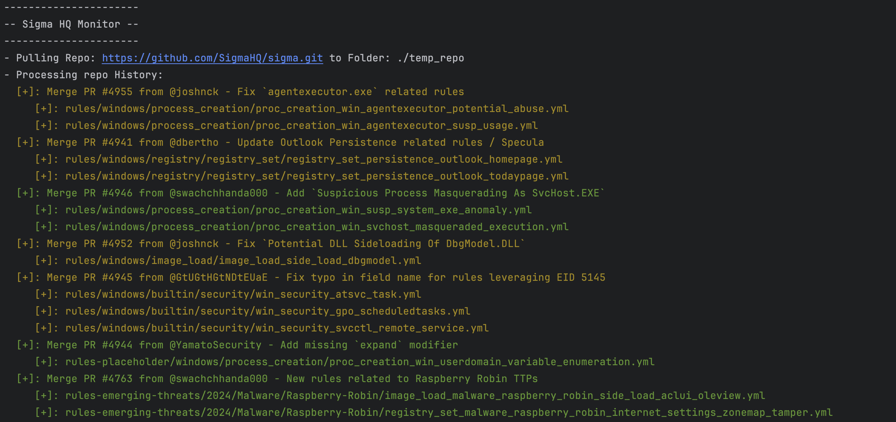
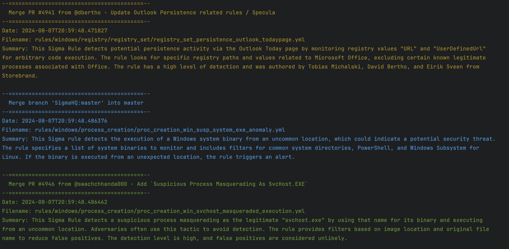

# SigmaHQ Monitor:
 - Simple prototype/proof of concept that pulls the commit history from the master repo.
It then parses this commit history looking for file changes. saves all information in an easily readable JSON file. 
 If openAI API key is added to config file, it summarizes sigma files. (~$0.01-$0.03 for a full 30 day scan)

## Install:
Clone Repo: 
>git clone https://github.com/dmille6/sigmaHQ_Monitor.git

Create new config file

>python sigmaHQ_Monitor.py 

 
> nano config.yml

edit config file in whatever text editor you want

## Basic Usage:
> python sigmaHQ_monitor.py

## Example Output
Basic Output:

Detailed File Summary:

